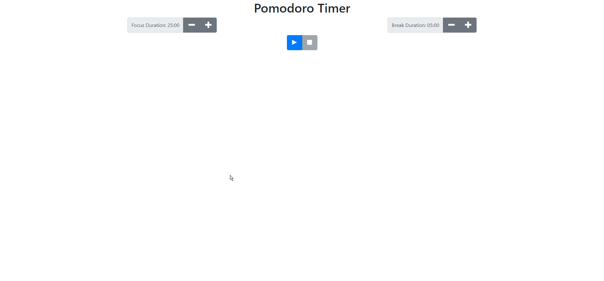
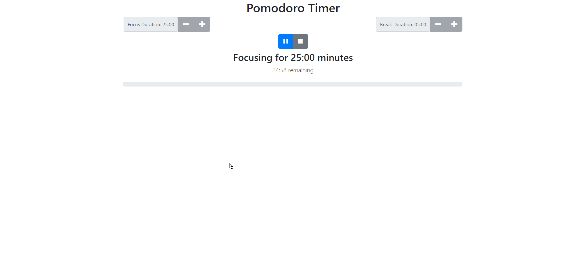
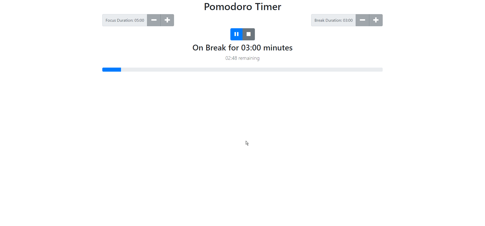

# Pomodoro Timer

A Pomodoro Timer is a time management method used to optimize an individuals time on a task. The work for the task is broken down into timed work/study sessions separated by short breaks.
A typical session lenght is 25 minutes followed by a 5 minute break. The user can increase or decrease the work/study session and break times withing a given range.

## Home Page:

The duration of the focus session can be increased/decreased in 5 minute intervals with a minimum of 5 minutes and a maximum of 60 minutes.
The duration of the break session can be increased/decreased in 1 minute intervals with a minimum of 1 minute and a maximum of 15 minutes.
Clicking the start/play button will lock out the increase/decrease buttons and start the session.

## Ongoing Session:

A countdown timer and a progress bar can be seen at this time to track time remaining in the current session.
The session can be paused, or stopped. Stopping the session will return all settings to default.

## Break:

At the end of each session a bell will chime to alert the user that the session has ended and the next session will start immediately.
